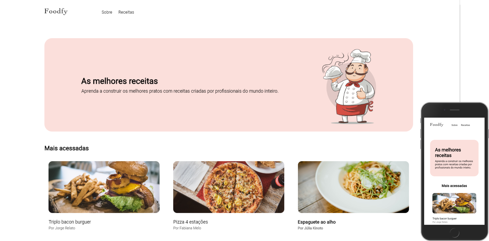

<div align="center">    
    <h1> Foodfy </h1>
</div>

<div align="center">
    
    
</div>

# Table of Contents
- [About](#-about)
- [Technologies](#-technologies)
<!-- - [Installation](#-installation) -->

---

## 📝 About
The **Foodfy** project is a recipe platform developed during the ***Launchbase Bootcamp*** of [Rocketseat](https://rocketseat.com.br)
. This was one of the first projects of the Bootcamp, which I increased some things of my preference and made the page responsive. 

---
## 🚀 Technologies
The project was developed with the following technologies: 

- HTML
- CSS
- JavaScript
- Node.js
- Nunjucks

---

<!-- ## 👇 Como baixar o projeto
```bash
    # Clonar o repositório
    $ git clone https://github.com/joaobrosin/foodfy

    # Entrar no diretório
    $ cd foodfy

    # Instalar as dependências
    $ yarn install

    # Iniciar o projeto
    $ yarn start
```
--- -->


Made with 💙 by ***João Brosin***.